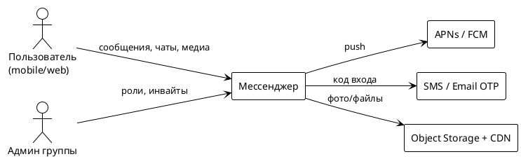
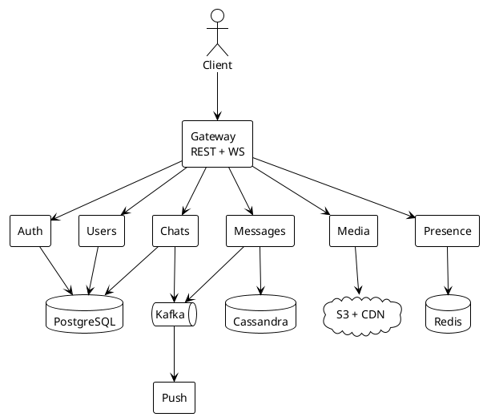

# Курсовой проект. Мессенджер с групповыми чатами

> Аналог Telegram. Система **не** совпадает с ДЗ 2–5 (доставка еды).  

---

# Часть A. Требования и концептуальная архитектура

## 1. Требования

### 1.1. Функциональные требования (scope)

1. Регистрация и вход (телефон / email), сессии на нескольких устройствах.
2. Профиль, поиск пользователей по username, список контактов.
3. Личные диалоги 1-to-1.
4. Групповые чаты до **200 участников**: создание, приглашение, роли admin/member, выход.
5. Отправка и получение текстовых сообщений, edit/delete у себя, reply, last-seen.
6. Вложения: фото и файлы до 20 МБ (видеозвонки и стриминг — вне scope).
7. Онлайн-статус и «печатает».
8. Push на мобильные при офлайне.
9. Синхронизация истории при входе с нового устройства (окно **1 год** горячей истории).

### 1.2. Нефункциональные требования

| Метрика | Значение |
|---------|----------|
| MAU | 10 000 000 |
| DAU | 2 000 000 |
| Сообщений отправлено на DAU в день | 30 |
| Доля сообщений с вложением | 10%, среднее вложение 200 КБ |
| Пик | ×3 вечером (20:00–23:00) |
| p99 доставки сообщения онлайн-получателю | < 500 мс в том же регионе |
| p95 открытия списка чатов | < 200 мс |
| Доступность контура отправки | 99,9% |
| RPO сообщений | секунды |
| RTO отправки | 10 мин |
| История | 1 год в горячем хранилище, старше — cold |
| Макс. размер группы в scope | 200 |

Формулы нагрузки:

```
сообщений_в_день = DAU × 30 = 2 000 000 × 30 = 60 000 000
avg_send_rps     = 60 000 000 / 86 400 ≈ 694
peak_send_rps    = 694 × 3 ≈ 2 080
```

Чтение (inbox + история при открытии чата) принимаем **×8** к отправке:

```
peak_read_rps ≈ 16 600
```

### 1.3. Риски и ограничения

- Медиа и egress — главная статья счёта; без CDN проект экономически не сходится.
- Группа на 200 человек × пик даёт fan-out. Без fan-out на запись (копии inbox) один чат упрёт шарды.
- Нельзя обещать E2EE «как в Telegram Secret Chats» без отдельного протокола — не берём.
- Команда условно небольшая: не плодим 20 сервисов.
- Один регион + DR warm standby. Multi-region active-active для сообщений — конфликт порядка и дорого.

### 1.4. Backlog (не в scope)

- Каналы и супергруппы 200k+
- Голосовые/видеозвонки, кружки, stories
- Секретные чаты с E2EE
- Боты-платформа и Mini Apps
- Полнотекстовый глобальный поиск по всем чатам пользователя (в MVP — поиск по открытому чату)
- Мультирегион active-active

---

## 2. Концептуальная архитектура

### 2.1. Стиль

**Микросервисы + event-driven на шине доменных событий**, синхронный путь только там, где клиенту нужен ответ сейчас (отправка сообщения, список чатов, загрузка файла).

Почему не монолит: разные профили нагрузки (короткие сообщения vs медиа vs presence vs push) и разные требования к консистентности.  
Почему не 15 сервисов: Contacts не отделяем от Users, edit/delete не отделяем от Messages.

### 2.2. Пользователи и внешние системы (C4 Context)

Акторы: пользователь (mobile / web / desktop), администратор группы.

Внешние: IdP / SMS-шлюз, APNs, FCM, object storage + CDN, антиспам (опционально).



### 2.3. Контейнеры (C4 Container)

| Контейнер | Ответственность |
|-----------|-----------------|
| API Gateway / BFF | TLS, JWT, rate limit, маршрутизация REST + WebSocket |
| AuthService | регистрация, OTP, сессии, refresh |
| UsersService | профиль, username, контакты |
| ChatsService | диалоги и группы: состав, роли, last_message pointer |
| MessagesService | запись/чтение сообщений, edit/delete, fan-out inbox |
| MediaService | upload URL, метаданные файла, не хранит блоб в своей БД |
| PresenceService | online / typing, короткий TTL |
| PushService | постановка и доставка пушей офлайн-устройствам |
| Kafka | события MessageSent, MemberAdded, UserRegistered |
| RabbitMQ | delayed retry пушей |
| PostgreSQL | users, chats, sessions |
| Cassandra / Scylla | сообщения и inbox |
| Redis | presence, кэш списка чатов, идемпотентность |
| S3 + CDN | файлы |



### 2.4. ADR

**ADR-1. Хранение сообщений в Cassandra, не в PostgreSQL**  
Контекст: 60 млн сообщений/сутки, чтение по `(chat_id, timestamp)`, редкие UPDATE.  
Решение: wide-column (Cassandra/Scylla), PK `(chat_id, message_id)`.  
Отвергнуто: PostgreSQL на все сообщения — партиции помогут, но write+fan-out и TTL на таком объёме больнее.  
Цена: нет JOIN «сообщение × пользователь»; имя отправителя денормализуем.

**ADR-2. Fan-out on write для личных чатов, fan-out on read для групп**  
Контекст: 1-to-1 vs группа 200.  
Решение: в личке пишем копию в inbox каждого; в группе пишем **один** ряд в партицию чата, получатели читают ленту чата.  
Отвергнуто: fan-out on write на 200 членов — 200 синхронных записей на каждое «привет».  
Цена: список чатов для группы обновляем асинхронно (last_message через Kafka).

**ADR-3. Не E2EE в MVP**  
Контекст: секретные чаты усложняют поиск, пуши, мультиустройство.  
Решение: TLS + at-rest, сервер видит текст. E2EE — backlog.  
Цена: угроза компрометации сервера; закрываем орг. мерами и узким доступом к кассандре.

---

# Часть B. Сайзинг, данные и взаимодействие

## 3. Сайзинг

### 3.1. RPS

| Поток | Событий / день | Avg RPS | Peak ×3 |
|-------|----------------|---------|---------|
| Отправка сообщения | 60 000 000 | 694 | **2 080** |
| Чтение истории / sync | 480 000 000 | 5 556 | **16 700** |
| Список чатов | 2 000 000 × 20 = 40 000 000 | 463 | **1 390** |
| Presence heartbeat | 2 000 000 × 200 ≈ 400 000 000 | 4 630 | **13 900** |
| Upload медиа | 6 000 000 | 69 | **210** |
| Download медиа (без CDN, origin) | см. §3.3 | — | — |
| Push | ~0,3 на сообщение офлайн ≈ 20 000 000 | 231 | **700** |

Узкие места: **чтение истории** и **presence**, не «создать чат».

### 3.2. Хранилище

Сообщение в Cassandra ≈ 2 КБ (текст + метаданные, без блоба):

```
60e6 × 2 КБ × 365 ≈ 44 ТБ / год сырых
×3 репликации Cassandra ≈ 132 ТБ
```

Горячий год держим. Старше 12 мес — холодное хранилище / TTL, если продукт так решит.

Медиа:

```
6e6 вложений/день × 200 КБ ≈ 1,2 ТБ / день
за год ≈ 438 ТБ сырых
реплика object storage ×2 ≈ 876 ТБ
```

Пользователи + чаты + сессии в PG: единицы ТБ, не они определяют счёт.

### 3.3. Bandwidth

Текст пика: 2 080 × 2 КБ ≈ 4 МБ/с — шум.

Медиа без CDN:

```
скачиваний в день ≈ загрузки × 4 (переслали / открыли)
6e6 × 4 × 200 КБ ≈ 4,8 ТБ / день
×30 ≈ 144 ТБ / мес egress
```

С CDN offload 90%: origin ≈ 14 ТБ/мес.

Presence и WS: мелкие кадры, десятки Мбит/с на пике, не сотни.

### 3.4. Ресурсы и стоимость (ориентир лекции, $/мес)

| Статья | Оценка | Комментарий |
|--------|--------|-------------|
| Compute (Gateway, Messages, Presence) | 4 500 | ~150 vCPU, autoscaling к вечеру |
| Cassandra 12 узлов × 8 ТБ | 12 000 | основной диск сообщений |
| PostgreSQL HA | 1 500 | users/chats |
| Redis cluster | 1 200 | presence + кэш |
| Kafka + RabbitMQ | 1 800 | |
| S3 hot 200 ТБ + cold 700 ТБ | 7 500 | tiering |
| Egress без CDN | 11 500 | 144 ТБ × $0,08 |
| Egress с CDN | 4 300 | 14 ТБ origin × $0,08 + 130 ТБ × $0,03 |
| **Итого без CDN** | **~40 000** | |
| **Итого с CDN + reserved** | **~28 000** | |

```
Cost / DAU ≈ 28 000 / 2 000 000 ≈ $0,014 в месяц
```

Сходится, только если медиа уехало на CDN и старые блобы — в cold.

---

## 4. Хранение данных

### 4.1. Выбор БД

| Сервис | БД | Почему |
|--------|----|--------|
| Auth, Users, Chats | PostgreSQL | связи, роли, уникальный username, транзакция «создать группу + добавить админа» |
| Messages | Cassandra/Scylla | append по чату, предсказуемый ключ, TTL, линейный write |
| Inbox указателей 1-to-1 | Cassandra | PK `user_id` |
| Presence | Redis | TTL 30–60 с, pub/sub typing |
| Кэш списка чатов | Redis | Cache-Aside, 30–60 с |
| Идемпотентность send | Redis | ключ `client_msg_id` на 24 ч |
| Медиа-метаданные | PostgreSQL | file_id → s3 key, размер, mime |
| Блобы | S3 + CDN | не в Cassandra и не в PG |
| Поиск по открытому чату | Cassandra clustering + фильтр | глобальный поиск — backlog / OpenSearch позже |

### 4.2. Шардирование

**Шаг 0.** PG users/chats на старте **не шардируем**: 10 млн профилей × 2 КБ ≈ 20 ГБ. Реплик достаточно.

**Messages — да, сразу.** 2k write RPS + 44 ТБ/год сырых на одну ноду не кладём.

| Что | Ключ | Стратегия | Почему |
|-----|------|-----------|--------|
| Сообщения | `chat_id` | hash / token-aware Cassandra | лента чата всегда в одной партиции, порядок по `message_id` |
| Inbox 1-to-1 | `user_id` | hash | «мои входящие» без scatter |
| Presence | `user_id` | Redis Cluster hash | heartbeat локален |

Не шардируем сообщения по `user_id`: групповое сообщение размажется на 200 партиций при записи.

Hotspot: супер-активный групповой чат. В scope лимит 200 и rate-limit на чат. Каналы 100k — backlog, там другая модель (лента канала + курсоры).

Ребалансировка Cassandra — virtual nodes, добавляем ноды без смены ключа.

Маршрутизация `GET message by id`: `message_id` содержит `chat_id` (или клиент всегда передаёт `chat_id`). Lookup-сервиса нет.

### 4.3. Кэш

| Уровень | Что | TTL | Инвалидация |
|---------|-----|-----|-------------|
| CDN | фото/файлы | часы–сутки | content-hash в URL |
| Redis | список чатов пользователя | 30–60 с | событие MessageSent / MemberChanged |
| Redis | профиль по user_id | 5 мин | UpdateProfile |
| Redis | presence | 30–60 с | heartbeat |
| Не кэшируем | тело сообщения как source of truth | — | читаем из Cassandra; короткий cache-aside на последнюю страницу чата допустим 10 с |

---

## 5. Взаимодействие

### 5.1. Протоколы

| Грань | Протокол | Почему |
|-------|----------|--------|
| Клиент ↔ Gateway, команды | REST / HTTPS | отправка, история, профили |
| Клиент ↔ Gateway, живой канал | WebSocket | новые сообщения, typing, presence |
| Gateway ↔ сервисы | gRPC | низкая задержка, контракт |
| Доменные события | Kafka, key=`chat_id` или `user_id` | порядок в чате, replay |
| Пуши с retry | RabbitMQ | delayed retry, TTL |
| Загрузка файла | HTTPS PUT в signed URL S3 | не гоняем блоб через Messages |
| Скачивание файла | HTTPS CDN | egress |

### 5.2. Схема (легенда)

Сплошная линия — sync (REST/gRPC). Пунктир — Kafka/Rabbit.

```
Client --WSS/REST--> Gateway
Gateway --gRPC--> Auth, Users, Chats, Messages, Media, Presence
Messages --solid--> Cassandra
Messages --dashed--> Kafka: MessageSent
Chats --dashed--> Kafka: MemberAdded
Kafka --dashed--> Push, Chats (обновить last_message)
Push --dashed--> RabbitMQ retry --> APNs/FCM
Media --solid--> S3 (signed URL)
Presence --solid--> Redis
```

### 5.3. API-контракты

**Отправить сообщение**  
`POST /api/v1/chats/{chatId}/messages`  
Headers: `Authorization`, `Idempotency-Key` (= `client_msg_id`)

```json
{
  "type": "text",
  "text": "Привет",
  "replyTo": null
}
```

`201`:

```json
{
  "messageId": "c7f2-01J...",
  "chatId": "c7f2",
  "senderId": "u9",
  "createdAt": "2026-09-03T10:00:00Z",
  "status": "accepted"
}
```

Ошибки: 401, 403 (не член чата), 409 (повтор ключа — вернуть старое messageId), 413, 429.

**История**  
`GET /api/v1/chats/{chatId}/messages?before={messageId}&limit=50`  
Только член чата. Ответ — страница по убыванию времени.

**Создать группу**  
`POST /api/v1/chats`

```json
{
  "type": "group",
  "title": "Дежурство",
  "memberIds": ["u1", "u2"]
}
```

`201`: `chatId`, `role=admin`.

**WS событие входящее**

```json
{
  "type": "message.created",
  "payload": {
    "chatId": "c7f2",
    "messageId": "c7f2-01J...",
    "senderId": "u9",
    "text": "Привет",
    "createdAt": "2026-09-03T10:00:00Z"
  }
}
```

**Загрузка файла**  
`POST /api/v1/media` → `{ fileId, uploadUrl, expiresIn }`  
Клиент шлёт байты в S3, затем `POST /messages` с `{ "type": "file", "fileId": "..." }`.

---

# Часть C. Надёжность, безопасность, защита

## 6. Надёжность

### 6.1. RTO / RPO

| Сервис | RTO | RPO | Почему |
|--------|-----|-----|--------|
| Messages | 10 мин | секунды | терять принятое сообщение нельзя; простой списка — можно минуты |
| Auth / Sessions | 10 мин | секунды | иначе все выкинуты |
| Chats / Users | 15 мин | минуты | состав группы важнее last_message |
| Media origin | 30 мин | минуты | CDN ещё отдаёт горячее |
| Presence | 5 мин | минуты | статус и так TTL |
| Push | 30 мин | минуты | пуш можно повторить |

### 6.2. Репликация

| Система | Как | RPO на практике |
|---------|-----|-----------------|
| Cassandra | RF=3, QUORUM read/write | ≈ 0 при живом кворуме |
| PostgreSQL Users/Chats | primary + sync replica в другой AZ | секунды / ≈0 на коммите |
| Redis | cluster, replica на шард | минуты, данные короткоживущие |
| Kafka | RF=3, min.isr=2 | ≈ 0 для подтверждённых |
| S3 | регион + версионирование + реплика бакета в DR | минуты |

Реплика ≠ бэкап. Снапшот PG + snapshot Cassandra + версионирование бакета. Restore-тест раз в квартал.

### 6.3. DR

Pilot Light / Warm Standby во втором регионе: async-реплика PG, реплика бакета, холодные ноды Cassandra под restore.

Падение региона: promote PG, восстановить Cassandra из снимка + replay (RPO минуты), переключить DNS. Presence строится заново с heartbeat. Медиа читается из реплики бакета / CDN.

Не active-active: иначе два порядка сообщений в одном чате.

## 7. Безопасность

- OIDC / JWT, короткий access, refresh на устройстве.
- `userId` только из токена.
- Авторизация: член чата видит историю; кикнуть может admin.
- Rate limit на send с одного user_id и на chat_id (антиспам).
- mTLS внутри, секреты в vault.
- TLS везде; диски Cassandra/PG и бакеты — at rest.
- Вложения: signed URL, антивирусный воркер в backlog.
- Не логируем текст сообщений в общем контуре — только ids и длины.

## 8. Observability

| Сервис / ресурс | Метод | Метрика | Зачем |
|-----------------|-------|---------|-------|
| Gateway | RED | RPS send / history | сверка с сайзингом |
| Gateway | RED | 5xx vs 4xx vs 429 | отказ vs клиент vs лимитер |
| Messages send | RED | p99 < 500 мс | SLO доставки accept |
| Messages read | RED | p95 history | открытие чата |
| Presence | RED | heartbeat rate | «все офлайн» = инцидент |
| Cassandra | USE | pending compact, tombstones | деградация чтения |
| Cassandra | USE | disk % | место кончится раньше RPS |
| PG | USE | pool utilization, replica lag | RPO |
| Kafka | USE | consumer lag | last_message и пуши отстают |
| Redis | USE | evicted, hit ratio списка чатов | |
| S3/CDN | USE | origin vs edge hit | счёт за egress |
| Бизнес | golden | accepted messages / мин | поток жив |
| Бизнес | golden | доля send 5xx | |
| Бизнес | golden | p99 end-to-end до WS получателя | |

Алерты (симптомы):

| Алерт | Порог | Sev | Реакция |
|-------|-------|-----|---------|
| Провал send | accepted/мин < 50% baseline 3 мин | crit | деплой, Cassandra, диск |
| p99 send > 800 мс 5 мин | SLO | crit | USE Cassandra / пул |
| 5xx Gateway > 2% 3 мин | отказ | crit | откат |
| lag Kafka > 2 мин | пуши и last_message | warn/crit | consumer |
| Cassandra disk > 80% | скоро запись встанет | crit | чистка TTL / ноды |
| CDN origin traffic всплеск | egress $ | warn | cache-key / hash URL |
| Presence rate ≈ 0 при живых WS | статус врёт | warn | Redis / WS |

## 9. Тестирование

**Нагрузка** (профили из §3):
1. Вечерний пик: 2 080 send + 16 700 history + 1 390 list.
2. Ступени ×1 → ×2 → ×3 → ×4, ищем излом p99.
3. Одна горячая группа 200 членов, 20 msg/s — проверка модели fan-out on read.
4. Soak 2 ч на 70% пика: нет роста tombstones/лага.

Успех: p99 send < 500 мс, 5xx < 0,5%, Cassandra pending не растёт, после снятия нагрузки метрики возвращаются.

**Chaos**

```
Эксперимент №1: Kill одной ноды Cassandra
Steady state:    accepted/мин в норме стенда, p99 send < 500 мс
Гипотеза:        RF=3 QUORUM переживёт потерю ноды без роста 5xx
Blast radius:    staging, 1 нода из 6
Метод:           stop ноды на 10 мин
Наблюдаем:       p99 send, 5xx, unavailable exceptions
Rollback:        5xx > 2% 2 мин — поднять ноду
Ожидаемый вывод: либо кворум работает, либо consistency level завышен/занижен
```

```
Эксперимент №2: Отказ APNs/FCM
Steady state:    онлайн-доставка по WS не деградирует
Гипотеза:        circuit + RabbitMQ retry, WS-путь не зависит от пушей
Blast radius:    staging, fault injection только egress push
Метод:           blackhole APNs 15 мин
Наблюдаем:       p99 send, глубина RabbitMQ, 5xx Gateway
Rollback:        5xx send > 1% — это уже протечка контура
Ожидаемый вывод: офлайн-пуш отложен, онлайн жив
```

```
Эксперимент №3: Задержка +300 мс к PostgreSQL Chats
Steady state:    p95 list chats < 200 мс (идёт из Redis)
Гипотеза:        список чатов обслуживается кэшем; create group замедлится,
                 send сообщения в существующий чат не заденет
Blast radius:    staging, toxiproxy только к PG Chats
Метод:           +300 мс 10 мин
Наблюдаем:       p95 list, p99 send, hit ratio Redis
Rollback:        p99 send вырос — значит скрытая связь Messages→PG
Ожидаемый вывод: либо кэш держит витрину, либо list ходит мимо Redis
```

---

## Согласованность частей

- Scope режет звонки и каналы — поэтому нет медиа-стриминга в сайзинге.
- 2 080 send RPS и 44 ТБ текста/год объясняют Cassandra, а не «Postgres везде».
- 144 ТБ egress без CDN объясняют ADR про объектное хранилище и алерт origin traffic.
- Fan-out on read в группах согласован с ключом шарда `chat_id`.
- Presence в Redis согласован с RPO «минуты» и хаосом «пуш отдельно от send».
- Стоимость без CDN ~$40k, с CDN ~$28k — тот же рычаг, что в методике курса.
